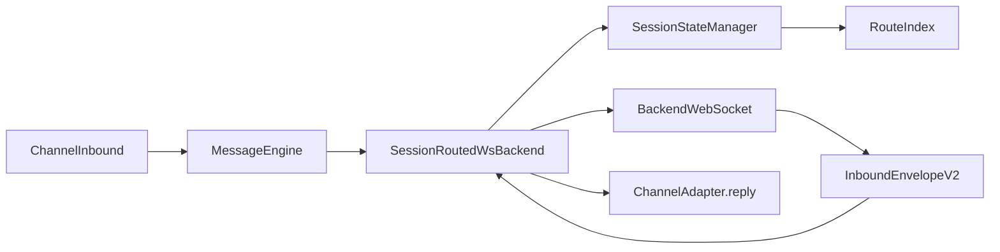

# Session Routing Architecture

## Goals

- Route channel inbound messages to the correct backend.
- Route backend outbound messages to the correct channel user.
- Reuse active backend sessions by route key, create a new session only when no active one exists.

## Routing model

Route key:

- `backendName + channel + channelUserId`

Session key:

- `backendName + sessionId`

Message key:

- `backendName + messageId` (from `IrisMessage.id`)

## Data flow

## Session reuse decision

For `chat()`:

1. Build route key from `(backendName, channel, channelUserId)`.
2. If an active session exists for the route key, reuse its `sessionId`.
3. If no active session exists, use incoming `message.sessionId` as new session id.
4. Persist state and route indexes.

## Backend inbound routing decision

For `message|message_update` inbound:

1. Validate V2 envelope and required payload fields.
2. Resolve state with fallback order:
   - `sessionId`
   - `messageId`
   - `channel + channelUserId`
3. If found, forward to `channelAdapter.reply`.
4. If not found, emit unknown-route warning with structured fields.

## Operational notes

- `channelUserId` must be platform native user id.
- `IrisMessage.id` is the unified message/request key across routing and tracing.
- Unknown-route suppression is retained to avoid log storms.
